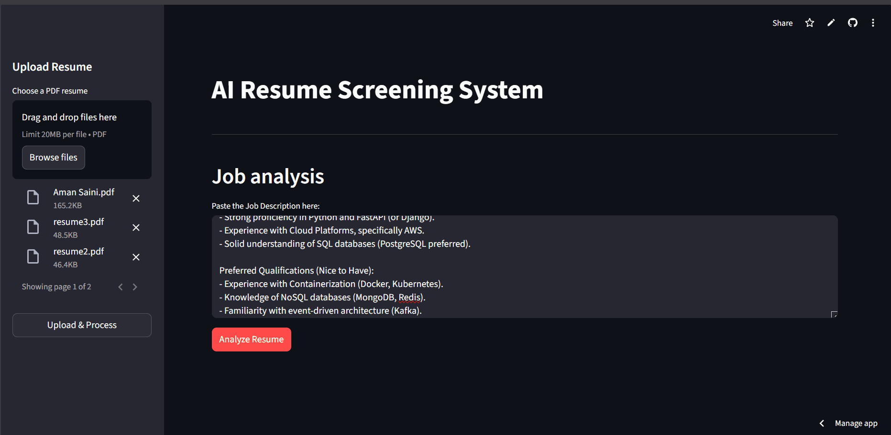

# AI Resume Analyzer

An AI-powered **Resume Screening & Analysis API** built using **FastAPI**, **ChromaDB**, **Groq LLM**, and **RAG (Retrieval-Augmented Generation)**.

This program allows you to:

* **Upload multiple resumes** (PDF)
* **Analyze resumes** against a Job Description
* **Rank candidates** automatically
* **Chat with a resume** using AI
* **Perform structured AI evaluation** with strict recruiter logic
 
## Live Demo
* **Frontend:** [[link](https://resumescanner-45.streamlit.app/)]

* **Backend API Docs**: [[link](https://resume-scanner-0g25.onrender.com/docs)]

<br>
<p align="center">
  
</p>
<br>

## Features
### **1️⃣ Resume Upload (Batch Support)**
- Accepts multiple PDF resumes
- Extracts text using pypdf
- Splits text using RecursiveCharacterTextSplitter
- Stores embeddings in ChromaDB
- Session-based resume tracking

### **2️⃣ AI Resume Analysis**
Analyzes resume against Job Description with:
- Matching keywords
- Missing keywords
- Experience validation
- Role mismatch detection

**Structured recommendation**:
- Strong Match
- Potential Match
- Reject

**Results are automatically ranked by**:
- Recommendation priority
- Number of matching keywords
- Years of experience

### **3️⃣ Resume AI Chat**
Ask questions like:
- “Does this candidate have cloud experience?”
- “List backend skills”
- “Is this person fit for a data engineering role?”

The system:
- Retrieves top 3 relevant chunks
- Grounds answers strictly in resume content
- Returns concise bullet-point responses

## Technical Stack
- **Backend:** FastAPI (Python)
- **Frontend:** Streamlit
- **LLM Orchestration:** Instructor + Groq (openai/gpt-oss-120b)
- **Vector Database:** ChromaDB
- **Embeddings:** FastEmbed (sentence-transformers/all-MiniLM-L6-v2)
- **PDF Parsing:** PyPDF

## API Endpoints

### Health Check
```http
GET /
```
Response:
```json
{
  "status": "OK",
  "message": "API is active"
}
```
### Upload Resumes

**POST** `/upload`

**Form Data:**
- `files` → list of PDF files

Response:
```json
{
  "message": "Success",
  "batch_id": "uuid-session-id",
  "count": 3
}
```
### Analyze Resumes
```bash
POST /analyze
```
Request:
```json
{
  "job_description": "Looking for a Backend Python developer with 3+ years experience in FastAPI and AWS",
  "session_id": "uuid-session-id"
}
```
Response:
```json
{
  "results": [
    {
      "filename": "eg_resume.pdf",
      "analysis": {
          "matching_keywords": ["Python", "FastAPI", "AWS"],
        "missing_keywords": [],
        "profile_summary": "Strong backend alignment...",
        "recommendation": "Strong Match",
        "years_experience_actual": 4,
        "years_experience_required": 3
      }
    }
  ]
}
```
### Chat with Resume
```bash
POST /chat
```
Request:
```json
{
  "resume_id": "session||filename.pdf",
  "question": "Does this candidate have Docker experience?",
  "job_description": "Backend Python Developer role"
}
```
Response:
```json
{
  "answer": "no"
}
```

## Setup & Installation
### Prerequisites
- **Docker Desktop** installed.
- A valid **Groq API Key**.

### 1. Clone the repository:

```bash
git clone https://github.com/Aman00240/RESUME_SCANNER
cd RESUME_SCANNER
```
### 2. Set up environment variables:
Create a .env file in the root directory:

```env
GROQ_API_KEY=your_groq_key_here
model=model_name_here(eg.,llama-3.3-70b-versatile)
```
### 3. Run with Docker:
```bash
docker-compose up --build
```
### 4. Access the App:
* **Frontend (UI):** Open [http://localhost:8501](http://localhost:8501) in your browser.
* **Backend (API Docs):** Open [http://localhost:8000/docs](http://localhost:8000/docs) to test endpoints directly.


